  

## About me

I build practical software with an emphasis on **Windows desktop development, performance analysis, automation, data visualization, and local AI workflows**.

I like software that feels fast, explains itself clearly, and turns noisy technical data into something useful.

## What I work on

<table>
<tr>
<td width="33%" valign="top">

### Windows software
Native desktop tools with responsive interfaces, careful UX, and a preference for doing the heavy lifting without getting in the user's way.

</td>
<td width="33%" valign="top">

### Performance & data
Benchmarking, telemetry, visualization, filtering, and workflows that make performance data easier to inspect and compare.

</td>
<td width="34%" valign="top">

### Automation & AI
Developer automation, repeatable workflows, and practical local-AI tooling aimed at reducing repetitive work.

</td>
</tr>
</table>

## Toolbox

  
  
  
  
  
  

## Featured work

### FrameView Analyzer

A native **Windows / .NET 10** application for analyzing and comparing NVIDIA FrameView captures and NVIDIA App performance logs. It focuses on interactive performance analysis, clear comparisons, useful filtering, and exportable reports.

  

  
  
  

## What I care about

- **Measurable performance** instead of vague impressions.
- **Clear interfaces** that keep technical complexity under control.
- **Predictable behavior** and reliable tooling over clever tricks.
- **Automation with a purpose**, especially when it removes repetitive work.

---

  Building, measuring, refining.

